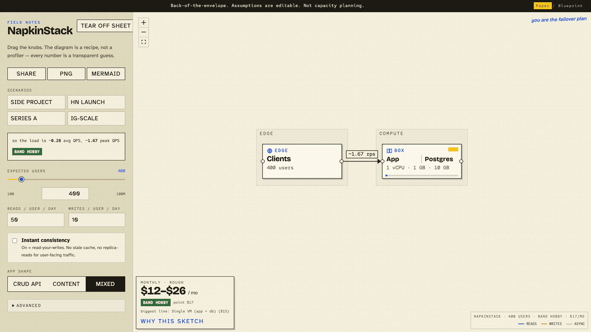
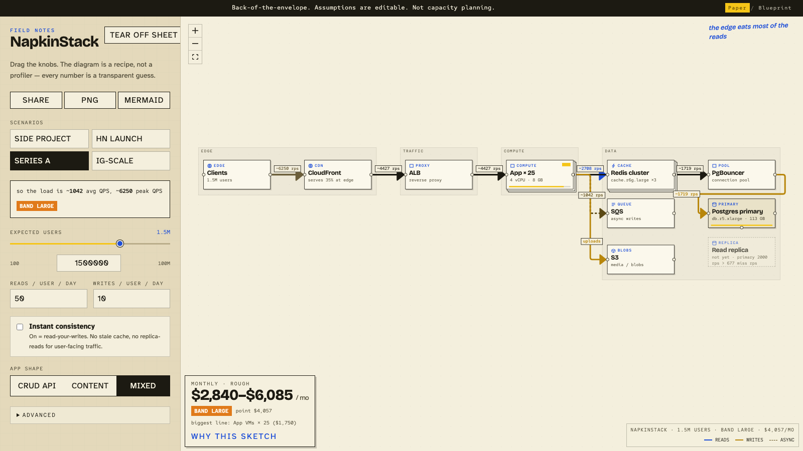
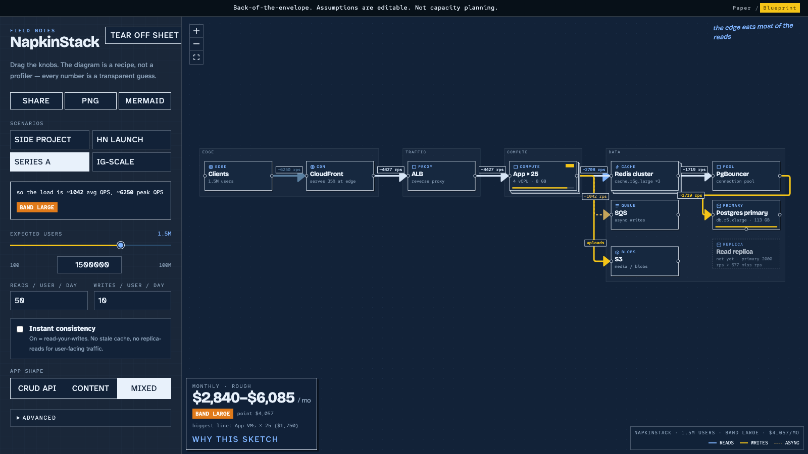

<div align="center">


# NapkinStack

**Drag a slider, watch the architecture and the AWS bill grow.**

Napkin math for scaling, drawn as a live diagram with the formulas left showing.

[](https://aviaryan.github.io/Napkin-Stack/)
[](LICENSE)




### [▶ Try it: NapkinStack](https://aviaryan.github.io/Napkin-Stack/)

</div>

---

System design interviews and "will Postgres hold?" Slack threads both open with
the same napkin math. NapkinStack does that math for you. Type in a few
capacity numbers and you get back a deliberately boring architecture, a scaled
monolith with the usual data-plane boxes around it, plus a rough monthly cost.
Every formula and assumption stays on screen, and you can edit all of them.

It is a sketch, not capacity planning. Nothing is profiled, no API gets called,
and after the first load it works offline. The numbers come from recipes you
can read in [`src/data/`](src/data/).

## What it does

- Four presets, one click each, covering a weekend side project through
  Instagram scale. Table below.
- Ghost boxes show what you *don't* need yet, and why. "The primary still has
  read budget left, so a replica would be idle."
- The instant-consistency toggle turns off stale reads. Watch read-your-writes
  take away your cache and your replicas, and add to your bill.
- Scaling rules that match what people actually do: scale up before out, shard
  once a single primary can't hold the writes, push reads to a CDN for content
  apps, cap the read replicas.
- Every knob lives in the URL, so a sketch is a link. The sheet also exports as
  a PNG, and the graph copies out as Mermaid.
- The math panel traces every number back to the formula that produced it.

| Paper | Blueprint |
|---|---|
|  |  |

## The presets

| Scenario | What happens | Rough bill |
|---|---|---|
| [Side project](https://aviaryan.github.io/Napkin-Stack/?u=400&r=20&w=4&i=0&s=crud&p=3&k=4&c=70&q=200&d=20&n=0&f=cheap&o=0) | One box. You are the failover plan. | **$7/mo** |
| [HN launch](https://aviaryan.github.io/Napkin-Stack/?u=40000&r=40&w=6&i=0&s=content&p=15&k=8&c=85&q=200&d=30&n=2&f=aws&o=65) | Front page, 15× peak, and the CDN starts earning its keep. | **$440/mo** |
| [Series A](https://aviaryan.github.io/Napkin-Stack/?u=1500000&r=50&w=10&i=0&s=mixed&p=6&k=5&c=80&q=200&d=50&n=2&f=aws&o=35) | Real traffic, still a monolith. Twenty-five of them. | **$4,057/mo** |
| [IG-scale](https://aviaryan.github.io/Napkin-Stack/?u=80000000&r=120&w=12&i=0&s=content&p=8&k=6&c=90&q=250&d=80&n=4&f=aws&o=65) | ~1M peak QPS, sharded Postgres, 404 app boxes, and still nothing exotic. | **$353,582/mo** |

Adding your own scale is a one-file PR to
[`src/data/presets.ts`](src/data/presets.ts).

## How the sizer thinks

`sizeArchitecture(input)` in
[`src/lib/sizeArchitecture.ts`](src/lib/sizeArchitecture.ts) is the whole
brain: pure function in, `{band, nodes, edges, cost, math, explanation}` out.

Bands come from **peak QPS**, not user count:

| band   | peak QPS |
|--------|----------|
| hobby  | < 50     |
| small  | < 300    |
| medium | < 2,000  |
| large  | < 10,000 |
| xlarge | ≥ 10,000 |

The knobs and ladders live in [`src/data/`](src/data/) and nowhere else:

- `recipes.ts` decides which boxes appear at each band (cache, CDN, queue, pooler…)
- `sizes.ts` holds the instance ladders, read/write budgets, fleet target, replica cap
- `prices.ts` holds ballpark USD/month, with `asOf` for when. **Update me.**
- `presets.ts` holds the named scenarios

There are two price flavors, AWS-ish and cheaper-managed (PlanetScale or
Fly-style). Cost always comes out as a range, 0.7× to 1.5× around the point
guess, because a napkin doesn't give you a single number.

## FAQ

**Is it accurate?** No, and it isn't trying to be. Every number is a guess you
can see, argue with, and edit.

**Why no Kubernetes or microservices?** Because at these numbers you almost
certainly don't need them.

**Can I use it in interviews or lectures?** Yes, that's what it's for. Export
the PNG, share the URL, steal the numbers.

## Hacking on it

```bash
pnpm install
pnpm dev        # Vite dev server
pnpm test       # vitest, sizing logic
pnpm build      # static site → dist/
```

React + TypeScript + Tailwind, canvas by [`@xyflow/react`](https://github.com/xyflow/xyflow).
The production build is a static folder, and GitHub Pages deploys it from
[`.github/workflows/deploy.yml`](.github/workflows/deploy.yml).

## License

[MIT](LICENSE). Use it to teach. Do not ship it as a capacity plan.

---

<div align="center">

Star the repo if it saved you a whiteboard argument.

</div>
